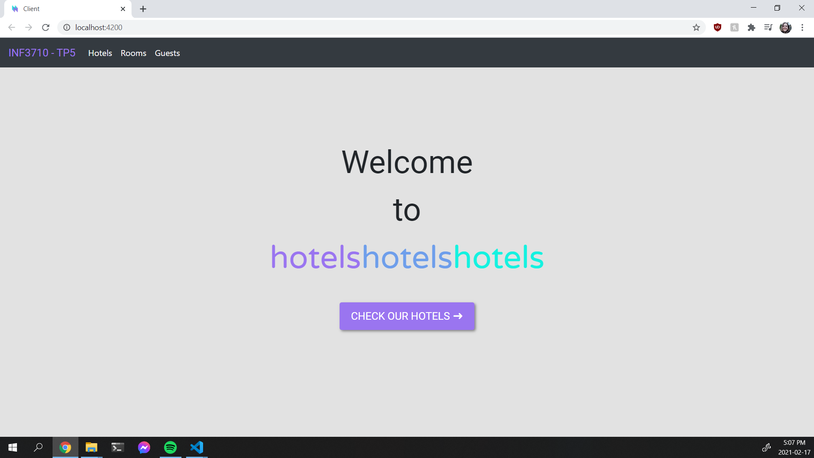
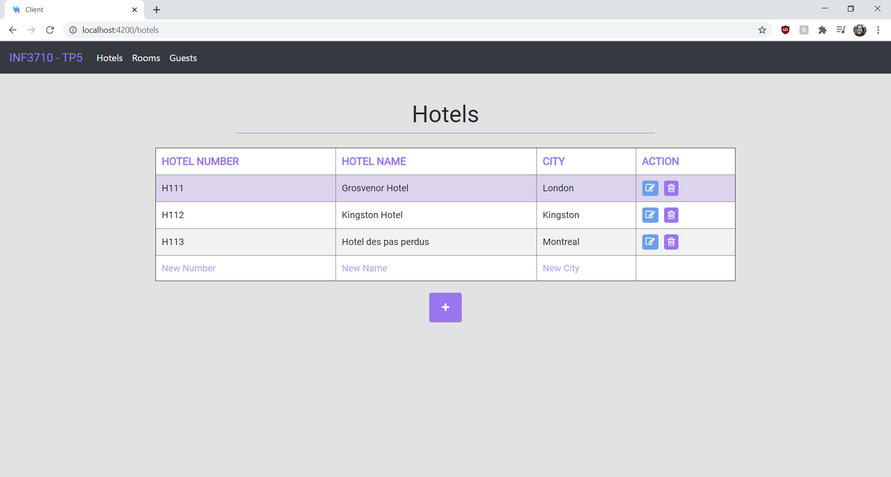
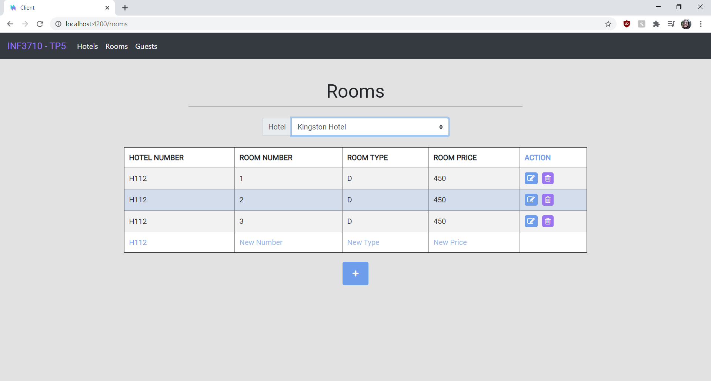
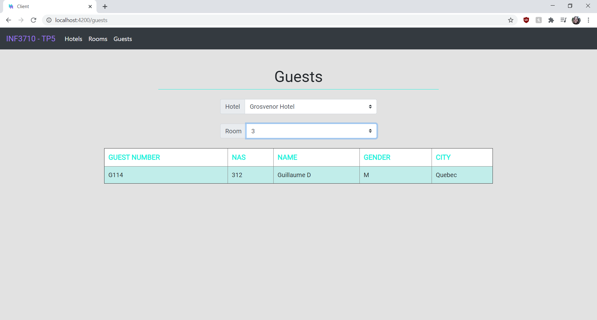

# INF3710_TutorielApp

Tutoriel du projet d'INF3710

## Avant de lancer le projet
- Assurez-vous que Postgres roule sur vos machines 

- Vérifiez que vous avez NodeJs installé avec `node –v`, si vous ne l'avez pas fait, veuillez suivre les étapes dans les dispos du labo

- Allez dans `/client`  et lancez `npm install`

- Allez dans `/server` et lancez `npm install​`

- Allez dans `/server/app/services/database.service.ts` et modifiez `connectionConfig` avec les bons paramètres de votre BD​

## Pour lancer le projet

- Allez dans `/server` et faites `npm start`​

- Allez dans `/client` et faites `npm start`​

## Demo Screenshots (remove for actual readme)

